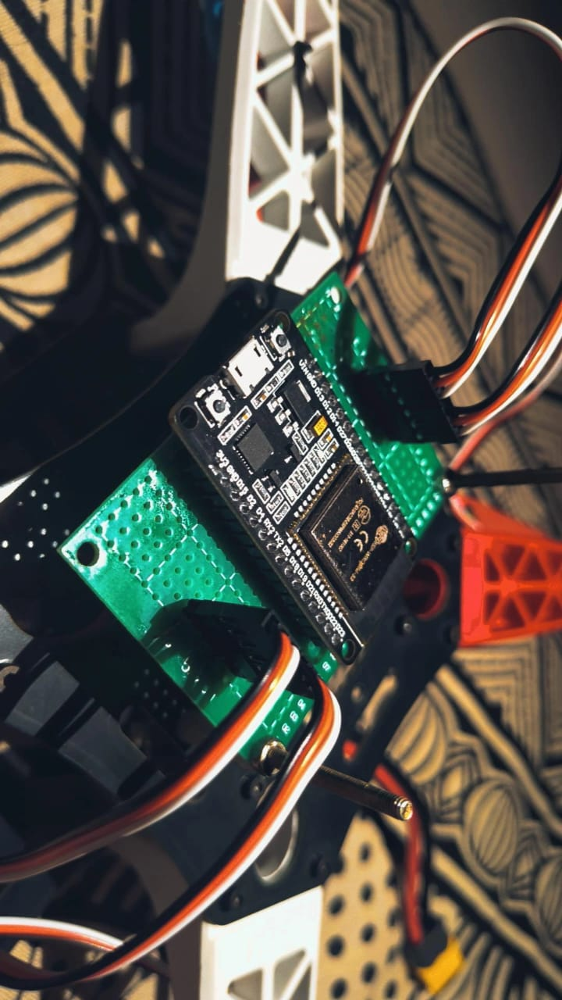

# 🚁 ESP32-Based Quadcopter Flight Controller

I chose the ESP32 as the flight controller primarily for its low cost, onboard WiFi & BLE capabilities, and potential for future ROS integration.

---
## 📷 Build Photos

 
<i>ESP32 mounted on perfboard and attached to the F450 frame</i>

 
<i>PID tuning and motor testing workspace setup</i>

---

## ✅ Testing Before Flight

Use the testing codes provided in the `test/` folder:

- `measure_angles_from_mpu.ino` – Validate IMU angle output
- `motor_calibration_esp32.ino` – Calibrate and sync ESCs/motors
- `anglemode_flightcontroller_ver3.1_PID_values_tuning_webserver.ino` – PID tuning via webserver

Refer to hand-drawn circuit diagram in:

---

## 🧪 IMU Calibration & Code Update

1. **Calibrate IMU**
   - Run: `Gyro_accelerometer_calibration.ino` from `src/`
   - Place the quadcopter on a flat surface and log the calibration values via serial monitor.

2. **Update Flight Code**
   - Insert those calibrated offset values into the `setup()` of `Anglemode_flightcontroller_ver3.1.ino`

---

## 🛠️ PID Gain Tuning

- Use `anglemode_flightcontroller_ver3.1_PID_values_tuning_webserver.ino` to wirelessly tune PID via WiFi.
- Recommended to watch the YouTube video (linked above).
- If you're using an **F450 frame**, the default values in code should be close; for other frames, tune accordingly.

---

## 🚀 Flight Prep Checklist

1. ✅ Calibrate IMU and insert offsets
2. ✅ Ensure motor and propeller direction matches schematic
3. ✅ Secure all connections and components
4. ✅ Upload the main flight code after verification
5. ✅ Do **initial flight testing outdoors**
6. ⚠️ **SAFETY FIRST**:
   - Always test with props off when debugging
   - Wear safety glasses during live tests
   - Keep your hands and face away from the frame during armed state

---

## 📌 References

- [Joop Brokking](https://www.youtube.com/@Joop_Brokking)  
- [Carbon Aeronautics](https://youtube.com/@carbonaeronautics?si=-DZ1Sz5sgNruoJgR)

---

## 🧑‍💻 Author

**Ayush Rai**  
📧 [rai4ayush@gmail.com](mailto:rai4ayush@gmail.com)  
🔗 [GitHub](https://github.com/Ayush-31r) | [LinkedIn](https://linkedin.com/in/ayush-rai-v1)

**Saurabh Yadav**
📧 [sy084464@gmail.com](mailto:sy084464@gmail.com)  
🔗 [GitHub](https://gitHub.com/saurb-yadav) | [LinkedIn](http://www.linkedin.com/in/saurabh-yadav-3b1283256)

